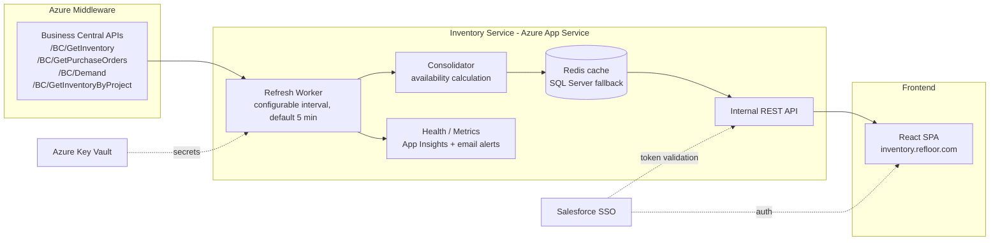

# React Inventory Website — Build Plan

Companion to [requirements-consolidated.md](./requirements-consolidated.md).

---

## 1. System Architecture



**Key decisions**
- **Service + SPA, not BFF-per-page:** one Inventory Service owns all Business
  Central access; the React app never talks to `dev.myx.ac` directly (keeps the
  `refloor_auth` credential server-side in Key Vault).
- **Cache-aside is wrong here — use refresh-ahead:** the worker refreshes on a
  timer and swaps the cache atomically (write to a staging key, then rename/
  pointer-swap). Readers always hit a complete snapshot; a failed refresh
  leaves the previous snapshot in place with its timestamp.
- **Runtime-configurable interval:** store the interval in App Configuration /
  a config table read each cycle — satisfies "configurable without deployment".

## 2. Suggested Tech Stack

| Layer | Choice | Notes |
|---|---|---|
| Frontend | React 18 + TypeScript + Vite | SPA on Azure App Service (or Static Web Apps behind same domain) |
| UI grid | TanStack Table + virtualization | "Large dataset" grouped grid with conditional formatting |
| State/data | TanStack Query | Polling `refreshedAt`, cache invalidation for "Last Updated" |
| Styling | Tailwind (or CSS vars) with brand tokens | Navy `#262262`, gold `#D29B3C`, blue `#30AEE4` |
| Backend | .NET 8 Web API + hosted BackgroundService | Fits Azure/BC ecosystem; Node/NestJS acceptable alternative |
| Cache | Azure Cache for Redis (preferred) | SQL Server table fallback per spec |
| Auth | Salesforce SSO (OIDC/SAML) | Mirror `cxsales.refloor.com` model |
| Secrets | Azure Key Vault | `refloor_auth`, Redis connection string |
| Observability | Application Insights + email alerts | Refresh success/failure metrics |

## 3. Data Model (cache snapshot)

One immutable snapshot per refresh cycle:

```ts
interface Snapshot {
  refreshedAt: string;          // ISO — drives "Last Updated"
  sourceStatus: Record<'inventory'|'purchaseOrders'|'demand', 'ok'|'failed'>;
  items: ConsolidatedItem[];
}

interface ConsolidatedItem {
  itemNo: string;               // "IN-100103"
  description: string;
  i360Id: string;
  itemCategoryCode: string;     // FLOORING | MOLDING | TRANSITIONS | ...
  sqftPerCase: number;
  linearFtPerUnit: number;
  locationCode: string;         // canonical key (see gap #6: null handling)
  locationName: string;
  onHand: number;               // qoh
  allocated: number;            // Σ demand rows for item+location
  ordered: number;              // Σ qpo across open POs
  available: number;            // onHand - allocated  (CONFIRM formula)
  availableSqft: number;        // available * sqftPerCase
  nextReceiptDate?: string;     // earliest expected_Receipt_Date
  status: 'green' | 'yellow' | 'red';  // thresholds TBD (gap #2)
}
```

Project view is computed on request from `GetInventoryByProject` (cached
per-project with short TTL) joined against the snapshot.

## 4. Internal API Surface (Service → React)

| Endpoint | Purpose |
|---|---|
| `GET /api/inventory?location=&category=&search=` | Satellite screen grid (grouped, filtered) |
| `GET /api/locations` | Satellite dropdown |
| `GET /api/categories` | Category filter |
| `GET /api/projects/{projectNo}` | Project screen: flooring + additional materials + readiness |
| `GET /api/projects/search?q=` | Sale/project lookup (source TBD — gap #7) |
| `GET /api/status` | Last refresh time, per-source health (dashboard status) |
| `POST /api/admin/refresh` | Manual refresh trigger (if approved — gap #11) |

All endpoints require a validated SSO session; responses carry `refreshedAt`.

## 5. Frontend Component Breakdown

```
<App>                         // auth guard, theme, layout
├── <Sidebar>
│   ├── <NavMenu>             // Satellites | Projects | Inventory Status
│   ├── <InventoryFilters>    // satellite/category/item dropdowns + clear (Satellite view)
│   ├── <SaleSelection>       // sale header fields (Project view)
│   └── <InventoryStatusPanel>// status dots + gold warning callout (Project view)
├── <Header>                  // title, project search, refresh icon, LastUpdated
├── <SatellitePage>
│   └── <InventoryGrid>       // virtualized, grouped by category
│       └── <AvailabilityCell>// green/yellow/red conditional formatting
├── <ProjectPage>
│   ├── <MaterialsTable kind="flooring">
│   ├── <MaterialsTable kind="additional">
│   └── <ItemStatusIcon>      // green check / warning
└── <StatusPage>              // service health / refresh history (scope TBD)
```

Design tokens: background `#262262` (navy), selected/interactive `#30AEE4`,
warning callout `#D29B3C`, text `#FFFFFF`; status colors follow the Power BI
green/yellow/red semantics.

## 6. Build Phases

### Phase 0 — Foundations (blockers first)
- [ ] Rotate the exposed `refloor_auth` credential; load from Key Vault.
- [ ] Resolve open questions (availability formula, thresholds, sale-header
      source, "Picked" source, Item Details scope) — see requirements doc §7.
- [ ] Provision Azure: App Service, Redis, Key Vault, App Insights, DNS/SSL
      for `inventory.refloor.com`.
- [ ] Confirm Salesforce SSO integration pattern from `cxsales.refloor.com`.

### Phase 1 — Inventory Service core
- [ ] Typed clients for the four BC endpoints (retry with backoff, timeout).
- [ ] Consolidator: join inventory + POs + demand into `ConsolidatedItem[]`.
- [ ] Snapshot cache with atomic swap; retain last-good on failure.
- [ ] Refresh worker with runtime-configurable interval (default 5 min).
- [ ] Structured logging + App Insights metrics + email alerts on failure.
- [ ] Internal API endpoints + `/api/status`.

### Phase 2 — React app: Satellite screen
- [ ] App shell, dark theme tokens, responsive layout, SSO auth guard.
- [ ] Sidebar filters (satellite/category/item, clear filters).
- [ ] Virtualized grouped inventory grid with conditional formatting.
- [ ] "Last Updated" indicator + auto-repoll of `/api/status`.

### Phase 3 — React app: Project screen
- [ ] Project/sale search + Sale Selection panel.
- [ ] Flooring and Additional Materials tables with totals + item status icons.
- [ ] Inventory Status panel with readiness dots + warning callout logic.

### Phase 4 — Hardening & release
- [ ] Inventory Status / health dashboard page.
- [ ] Load test with production-scale dataset; tune Redis + grid virtualization.
- [ ] QA pass against Power BI parity checklist (Matthew Elias).
- [ ] Pilot with Project Coordinators; cut over from Power BI.

## 7. Testing Strategy

- **Unit:** consolidation math (availability, ft² conversion, threshold
  classification), null `locationCode` handling, atomic-swap behavior.
- **Contract:** recorded fixtures from the four BC endpoints; alert on schema
  drift (`expected_Receipt_Date` casing, nullable fields).
- **Integration:** refresh cycle against sandbox (`instance=sandbox`) —
  failure path must keep serving the previous snapshot.
- **E2E (Playwright):** satellite filtering, project readiness states
  (all-green vs missing-materials warning), Last Updated refresh.
- **Parity:** side-by-side spot-check vs the Power BI dashboard for a sample
  of satellites/projects before cutover.
